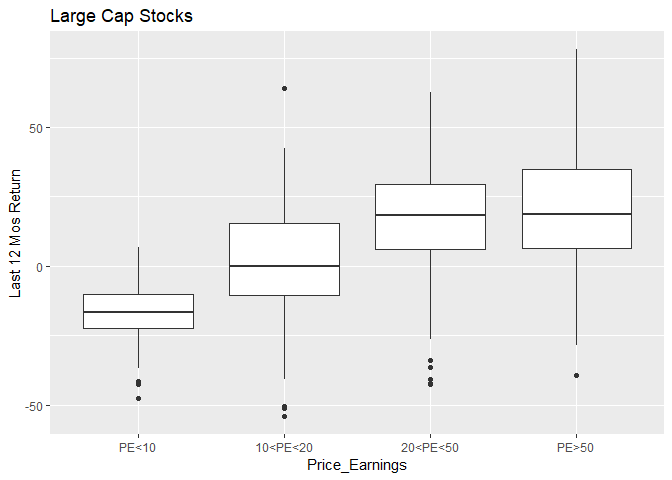
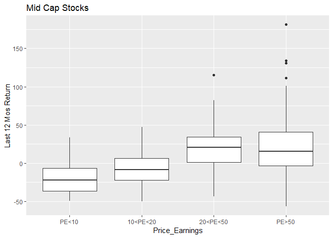
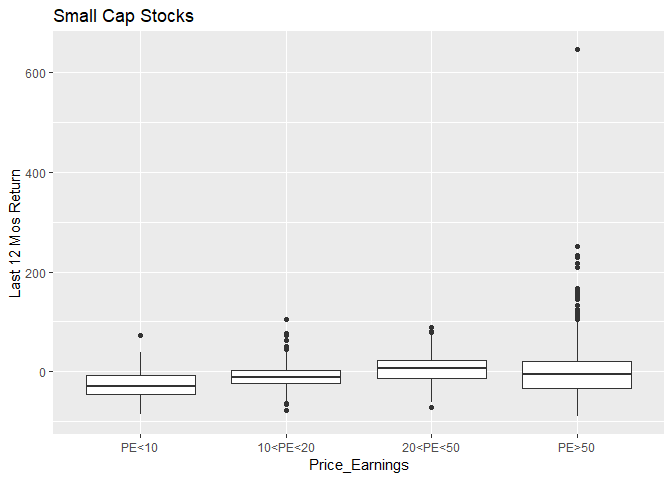

```
## Warning: package 'Rblpapi' was built under R version 3.4.4
```

```
## Rblpapi version 0.3.9 using Blpapi headers 3.8.18.1 and run-time 3.8.18.1.
```

```
## Please respect the Bloomberg licensing agreement and terms of service.
```

```
## Warning: package 'tidyverse' was built under R version 3.4.4
```

```
## -- Attaching packages ------------------------------------------------------- tidyverse 1.2.1 --
```

```
## v ggplot2 3.1.0       v purrr   0.3.2  
## v tibble  2.1.1       v dplyr   0.8.0.1
## v tidyr   0.8.3       v stringr 1.4.0  
## v readr   1.3.1       v forcats 0.4.0
```

```
## Warning: package 'ggplot2' was built under R version 3.4.4
```

```
## Warning: package 'tibble' was built under R version 3.4.4
```

```
## Warning: package 'tidyr' was built under R version 3.4.4
```

```
## Warning: package 'readr' was built under R version 3.4.4
```

```
## Warning: package 'purrr' was built under R version 3.4.4
```

```
## Warning: package 'dplyr' was built under R version 3.4.4
```

```
## Warning: package 'stringr' was built under R version 3.4.4
```

```
## Warning: package 'forcats' was built under R version 3.4.4
```

```
## -- Conflicts ---------------------------------------------------------- tidyverse_conflicts() --
## x dplyr::filter() masks stats::filter()
## x dplyr::lag()    masks stats::lag()
```

<!-- --><!-- --><!-- -->

